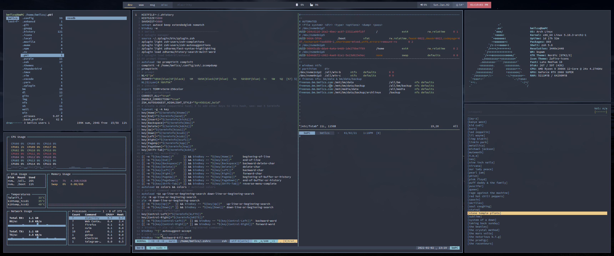

# BMILCS: DOTFILES
> A few weeks into my journey... 01.02.2021

 
**Welcome to version 2 of my dotfiles.** 

Established in December of 2020 with 2 years of [***light* Debian experience**](https://github.com/bmilcs/linux) under my belt, this GitHub repository became the official home for my personal configuration files. Putting food on the table binds me to Microsoft Windows for 40 hours a week. However, I took the plunge and installed ArchLinux as my primary operating system within a dual-boot configuration and vow to use nothing else in my leisure time. 

---

## **NAVIGATION**
- [**to do**](#todo)
- [**my goals**](#goals)
- [**bspwm**](.config/bspwm/bspwmrc) :  *window manager*
- [**sxhkd**](.config/sxhkd/sxhkdrc) : *keyboard shortcuts*
- [**polybar**](.config/polybar/bspwm.conf) [[**sh**]](.config/polybar/bspwm.sh) : *task/status bar*
- rofi : dmenu replacement
- picom.conf : compositor
- .tmux.conf : ide 
- vim : text editor

---

<a name="goals"/>

## GOALS

> In the mid-1990's, a box arrived in beautiful black & white cow print. It was love at first sight. It's now 24 years later and very little has changed. 

---

**VIM**
 - Adapt to, Learn & Master 
 - Combine Visual Studio Code's visual appeal & functionality via plugins, vimrc, shortcuts, etc.
 - Universally adopt VIM-functionality across most applications
    - IE: zsh, ranger, mutt, etc.

**GitHub**
 - Learn & adopt all common functions
 - Learn & practice version control w/ dotfiles

 **Dotfiles**
 - Automate installation & backup w/o third party tool
 - Review 100's of published repo's
 - Adopt favorite means of management
 - CAT bmilcs/linux bmilcs/dotfiles >> bmilcs/bm
  - Combine Debian-based VM dotfiles with Archlinux based workstation dotfiles, achieving uniform functionality across all Linux platforms.

**Programming | Scripting**
 - Setup a proper IDE 
 - Dive into Python
 - Increase exposure to BASH syntax

---

<a name="todo"/>

## TODO

**via YouTube ?**

- research: npm
- nettree
- retain visual  ( after a command )
    nmap Y y$
    vmap < <gv
    vmap > >gv

**via YouTube Plugins "Super Powers"**

- [ ] vim shortcut: auto :%s/VISUAL//gI
- [ ] vim autocomplete: shortcut? all ext, within file AND /path/to autocomplete
  - [ ] coc.vim visual studio-like autocompletion
- [ ] ctrlsf - 'command line searching"
- [ ] fzf fuzzy find - to "//"
  - rip grep? same thing?
- [ ] bcommits? git history-like plugin
- [ ] anyjump -- search across workspace
- [ ] lazygit -- lazydocker, lazynpm

**DotFiles & GITHUB**
  - [ ] setup ~/bm & move away from bare repo
      - establish directory hierarchy
      - cp all config files over
      - script backup & installation of symlinks
      - script update functionality
  - [ ] research: way of marking non-tracked files in home via 'ls'
  - [ ] function: add .ini w/ list of dirs to wildcard gita on push
    - ~/.local/bin
    - ~/bin
    - ~/snippets

**VIM**
  - [ ] tmux - learn tabs, buffers, etc.
  - [ ] functions() - ie: centered title bar w/ ascii characters
  - [ ] create workspaces (vs-code style w/ multiple text files opened at once)
  - [ ] improve hotkey knowledge
    - [ ] navigation - pgup/pgdn, visual blocks/lines/etc
    - [ ] more to come...
  - [ ] optimize vimrc
    - [ ] common improvements
    - [ ] keyboard shortcut tweaks
    - [ ] ..
  - [ ] research plugins 
    - [ ] git browser
    - [x] ~~file browser~~
    - [x] ~~moving lines up/down~~ 

**BSPWM**
  - [ ] ergonomic shortcuts
  - [ ] gap & padding shortcuts
  - [ ] automate workspace on login

**POLYBAR**

  - [ ] pkg update watcher notifications - distro/packages
  - [ ] add cpu/memory %'s
  - [ ] add networking up/down
  - [x] ~~*add volume*~~
  - [x] ~~*add music controls*~~

**SOFTWARE**
- [ ] neomutt - email

---

### links

- [**dotfile organization reddit (3yrs)**](https://www.reddit.com/r/linux/comments/61dbym/managing_dotfiles_a_survey/) 

  > One git repository for using with stow (eg. ~/.dotfiles). Git submodules for vim plugins etc. Branches for host-specific configuration, rebasing on master. Share master publicly.

  > ~/.git/ for some stuff that does not fit to the above.

  > ansible for other things that can't be done with the above.

- https://guides.github.com/features/mastering-markdown/ 
- https://www.reddit.com/r/unixporn/comments/8giij5/guide_defining_program_colors_through_xresources/

---

**ARCHIVE**
- [x] *add additional workstation env*
    - [x] *bspwm*
    - [ ] *openbox?*
    - [ ] *xfce*
- [x] *vs code replacement*
    - [x] *neovim?*
    - [x] *vim?*
    - [ ] *integrate github into terminal*
- [x] *ssh config variable host/rsa key*
- [x] *shortcut - restart to windows from archlinux*
- [x] *improve README.md*
    - [x] *add scrots*
    - [x] *add table of contents*
